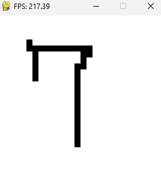

# mnist
Draw your own numbers and predict with mnist model.

# To Do

### Clone the repository.

```
git clone https://github.com/hsiang086/mnist.git
```
### Install requirements.
```
cd mnist
pip install -r requirements
```
### Run **paint.py** to draw the number, and press **d** for delete **s** for save. 
```
python paint.py
```

### Then run **main.py**.
```
python main.py
```